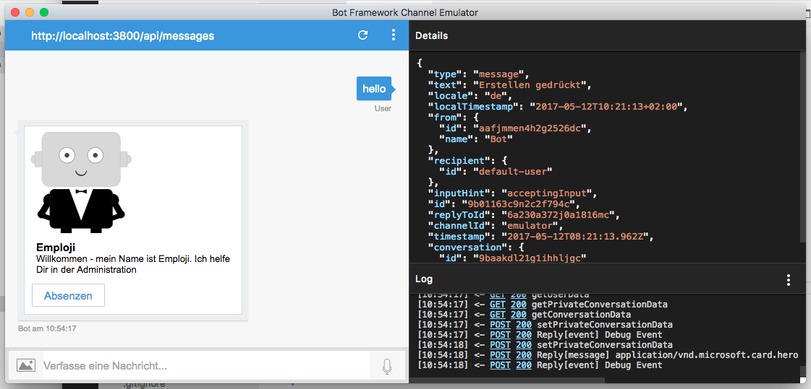
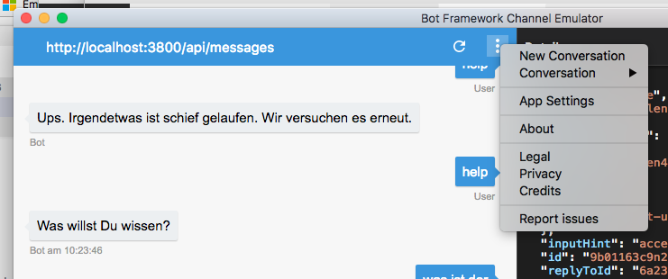

# emploji-bot
emploji bot as Employee self service assitant / focus days 2017 - internal hackathon AXA Winterthur

Additional readme: checkout our [hackzurich AXA 2016 GitHub](https://github.com/axa-azure-deployment/hackzurich2016-axa) for other ressources how to setup nodejs, Visual Studio Code, Mongodb if needed, Debugging, Nodemon

# Preconditions

- download and install nodejs environment
- download and install keypass (to read our passwords)
- download ngrok
- download Microsoft Bot Emulator
- login to Microsoft Bot framework: registering Bot
- login to Microsoft LUIS.ai: learning sentences (intents)
- login to Botsociety.io: designing the bot

## install nodejs environment

- https://nodejs.org/
- Download V6.10.* version and install
- Alternative Linux+Mac using https://github.com/creationix/nvm to support multiple version

## install node monitor 

to be able to automatically restart nodejs after a change in a file
See our [hackzurich documentation](https://github.com/axa-azure-deployment/hackzurich2016-axa#use-node-monitor-to-automatically-restart-node-on-change)

## install keypass 

- Download and install http://keepass.info/ to have access to our secured environments
- See file [emploji-pass.kdbx](keys/emploji-pass.kdbx)

## ngrok - secure tunnels to localhost

- download from https://ngrok.com/

## Microsoft Bot Emulator

- download the emulator to test locally or remote bots
- https://docs.microsoft.com/en-us/bot-framework/debug-bots-emulator
- Latest Windows Installer: https://emulator.botframework.com/
- Mac, Linux Installer: https://github.com/Microsoft/BotFramework-Emulator/releases
- install ngrok as described in article

# Microsoft botframework 

- https://dev.botframework.com
- Login with microsoft Live ID (employji@gmail.com)

- Principles of bot design https://docs.microsoft.com/en-us/bot-framework/bot-design-principles
- Quickstart Guide documentation NodeJS https://docs.microsoft.com/en-us/bot-framework/nodejs/bot-builder-nodejs-quickstart
- Examples on gitHub https://docs.microsoft.com/en-us/bot-framework/nodejs/bot-builder-nodejs-samples

# Microsoft LUIS / Language Understanding Intelligent Service  

- https://www.luis.ai
- Login with microsoft Live ID (employji@gmail.com)


# Install & run Bot

## Download emploji-bot template

```bash
git clone https://github.com/lolo8304/emploji-bot.git
```

## configure .env

```bash
cp _env .env
```

edit .env file and configure the 3 settings

use entry in keypass "MICROSOFT_APP_ID emploji bot"
- MICROSOFT_APP_ID= use "user-id" from entry
- MICROSOFT_APP_PASSWORD= use "password" from entry

use entry in keypass "MICROSOFT_LUIS_MODEL"
- MICROSOFT_LUIS_MODEL= use "MICROSOFT_LUIS_MODEL" entry

verify the BOT_DOMAIN pointing to localhost or server
- BOT_DOMAIN_URL=http://localhost:3800
- BOT_DOMAIN_URL=https://emploji-bot.herokuapp.com

verify the DB_URL pointing to localhost (no user and password needed)
- DB_APP_URL=localhost:27018/emploji-bot

verify the DB_URL pointing to remote DB if needed (user and password needed)
- DB_APP_URL=domain:port/name
- DB_APP_USER=user
- DB_APP_PWD=pwd


## Run

### using npm
```bash
cd emploji-bot
npm start
```

### using npm-monitor

every change of a file will restart
```bash
cd emploji-bot
./start-npm.sh
```

or windows
```bash
cd emploji-bot
start-npm.bat
```


## Test with emulator

- start emulator
- enter URL: http://localhost:3800/api/messages
- fill in the credentials from keypass
- type 'start' or 'hello'
- if all is fine you should see this
  


### start new conversation

- use "new conversation" or "refresh" in emulator 
  


# Design and test Bot

## Design with botsociety.io
we are using https://botsociety.io to design bot conversations.

